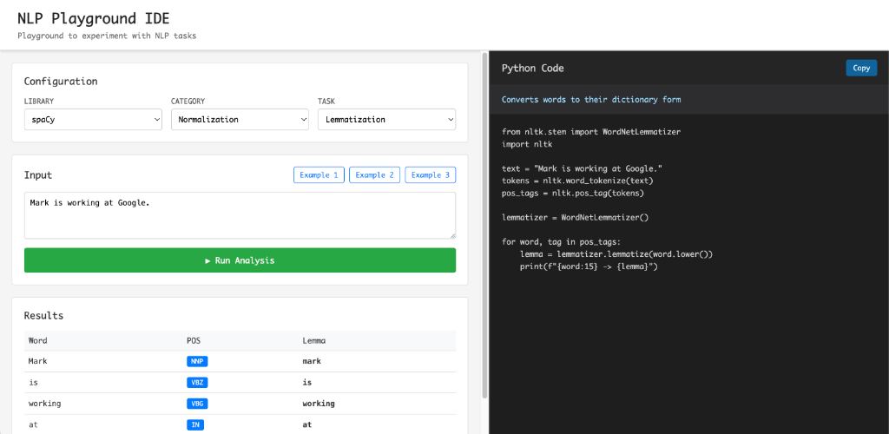
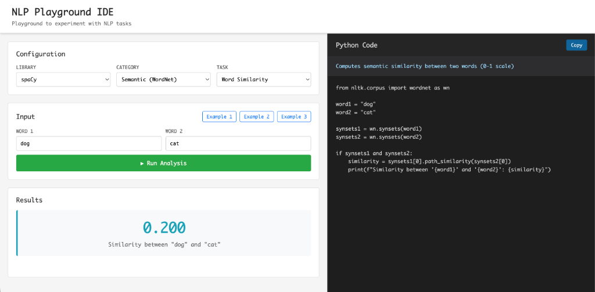

# NLP Playground IDE

An educational IDE for learning NLP through interactive visualization and code exploration. Built for PLH Lab 1.

## Screenshots

### Lemmatization Example


### Word Similarity with WordNet



## Features

### IDE Interface
- **Split-screen layout**: Results on left, Python code on right
- **Live code display**: See the exact Python code executing each task
- **Copy to clipboard**: Copy code snippets for your own experiments
- **Dynamic inputs**: Interface adapts to each task type

### NLP Categories

#### Basic (NLTK & spaCy)
- Tokenization
- POS Tagging
- Named Entity Recognition
- Dependency Parsing (spaCy only)

#### Semantic (WordNet)
- Synonyms - Find similar words
- Hypernyms - Find broader terms
- Word Similarity - Compute semantic similarity

#### Sentiment Analysis
- SentiWordNet-based sentiment scoring
- Word-level and overall sentiment

#### Text Similarity
- Jaccard Similarity - Set-based comparison
- Cosine Similarity - Vector-based comparison

#### Normalization
- Stemming (Porter & Lancaster)
- Lemmatization

#### Advanced
- N-grams generation

### Interactive Examples
- 3 example buttons for each task type
- Examples adapt to input type (text, word, dual texts, etc.)

## Installation

1. Install Python dependencies:
```bash
pip install -r requirements.txt
```

2. Download required NLTK data (automatic on first run):
```bash
python -c "import nltk; nltk.download('punkt'); nltk.download('averaged_perceptron_tagger'); nltk.download('maxent_ne_chunker'); nltk.download('words'); nltk.download('wordnet'); nltk.download('sentiwordnet')"
```

3. Download spaCy English model:
```bash
python -m spacy download en_core_web_sm
```

## Usage

1. Start the Flask server:
```bash
python app.py
```

2. Open your browser to:
```
http://localhost:5000
```

3. Select:
   - **Category**: Basic, Semantic, Sentiment, Similarity, Normalization, or Advanced
   - **Library**: NLTK or spaCy (where applicable)
   - **Task**: Specific NLP operation
   - **Input**: Enter text or use example buttons
   - **Run Analysis**: See results and code

## Technologies

- **Backend**: Flask, NLTK, spaCy, scikit-learn
- **Frontend**: Vanilla HTML/CSS/JavaScript
- **Visualization**: SVG-based dependency trees
- **Corpora**: WordNet, SentiWordNet

## Educational Value

Perfect for learning NLP because:
- See Python code for each operation
- Experiment with different inputs
- Compare NLTK vs spaCy implementations
- Understand NLP concepts through visualization

## Course Information

Created for PLH (Processament del Llenguatge Humà) Lab 1  
Grau en Intel·ligència Artificial - UPC
